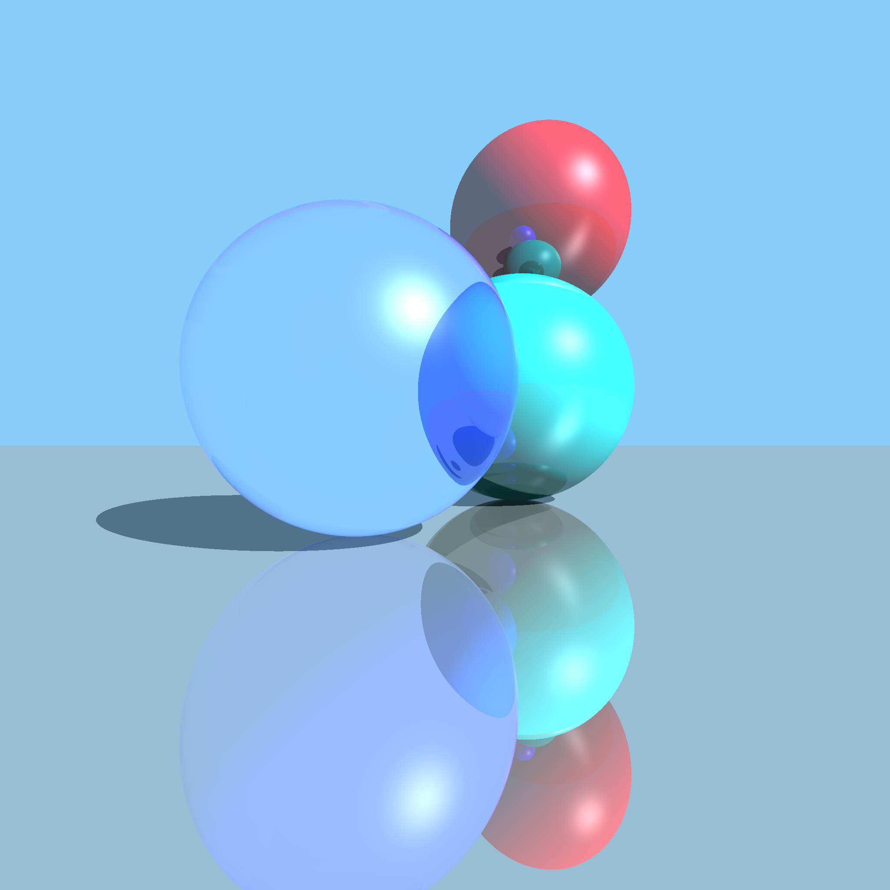

# raytracer

A simple ray tracer written in Rust.
Supports lighting, reflection, and refraction.

Made with much help from the algorithms at https://www.scratchapixel.com/lessons/3d-basic-rendering/minimal-ray-tracer-rendering-simple-shapes.

Build and Run:
```
cargo run --release
```

`--release` flag highly recommended so it doesn't take an eternity.

Increasing the number of threads in the thread pool in `main.rs` may also help in increasing speed. (Default = 4)


